# anthropometer &nbsp;·&nbsp; `amtr`

**A btop-style, real-time diagnostic instrument for Claude Code sessions.**

`amtr` attaches to a Claude Code session's transcript and renders — live — exactly
what is happening inside the model's context window: how the token budget is being
spent, which files and tools are resident, when compactions fire, what subagents
are doing, and the true cost of every turn. Press **`R`** and it compiles a
ground-truth PDF report of the whole session.

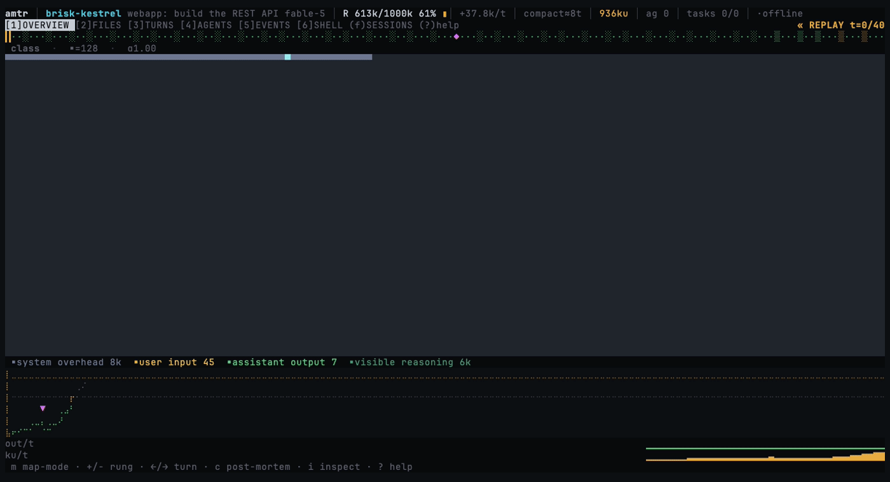

<sub>↑ replaying a session turn-by-turn: the context map fills, the composition shifts, the trend climbs.</sub>

[](LICENSE)
&nbsp;·&nbsp; [](#-ai-usage)
&nbsp;·&nbsp; Rust + ratatui TUI · Python engine · terminal-only

---

## 🎛️ AI usage

```text                                                              
 hand-written ▕█████████████████████████ **100%** █████████████████████████▏ vibe coded  
              └── none ──── copilot ──── pair-programmed ──── VIBE CODED ──┘
```

---

## Why

`/context` gives you one number. `amtr` gives you the whole picture, continuously:
the context window as a **live memory map**, file access as a **traffic seismograph**,
cache economics as a **per-turn ledger**, compactions as **forensic events**, and
subagents as an **economics table** — every quantity labeled *authoritative*
(read straight from the API usage records) or *estimated*, never blurred together.

It works on any Claude Code session — interactive or headless (`claude -p`) — because
every session already writes a complete transcript. `amtr` just reads it in real time.

---

## The live TUI

A fast, keyboard-driven terminal UI. Tabs `1`–`6`, `f` for the session picker,
`i` to inspect, `R` to build a report, `?` for help, `q` to quit.

### Context map — where your budget actually goes

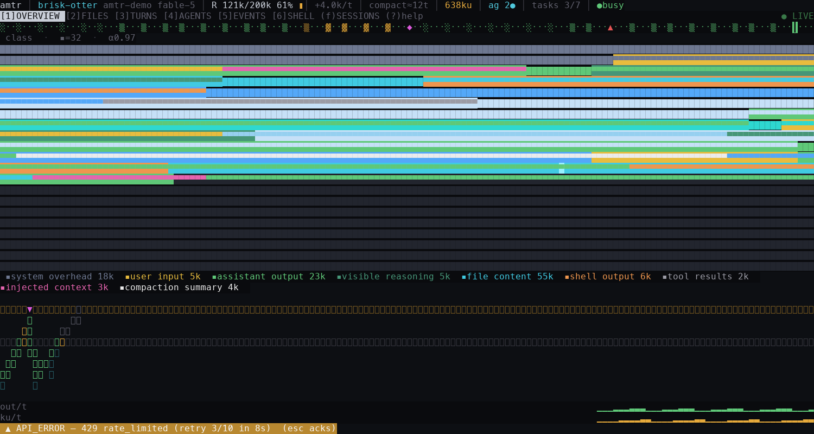

The resident context as a **fixed-scale grid**: the whole box *is* the budget, and
every cell is colored by what occupies it — system overhead, file content, hidden
reasoning, shell output, tool results, and more. At a glance you see how full you
are and what's filling you up. `m` cycles four lenses (category · access-heat ·
turn-age · cache billing); `i` walks the segments like a memory debugger and reads
back the **actual text** occupying any region.

### Files & subagents

| Live file traffic (`2`) | Subagent fan-out (`4`) |
|---|---|
| 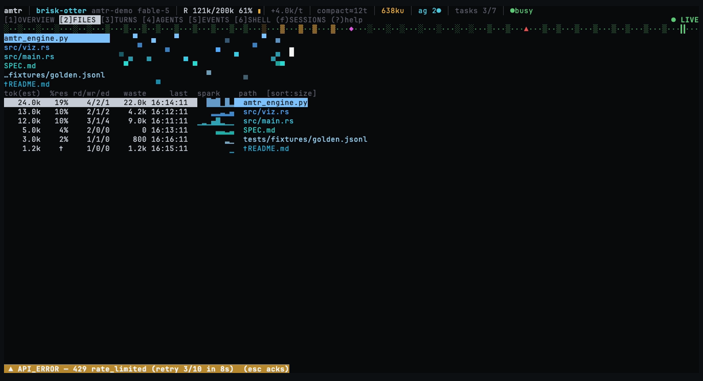 | 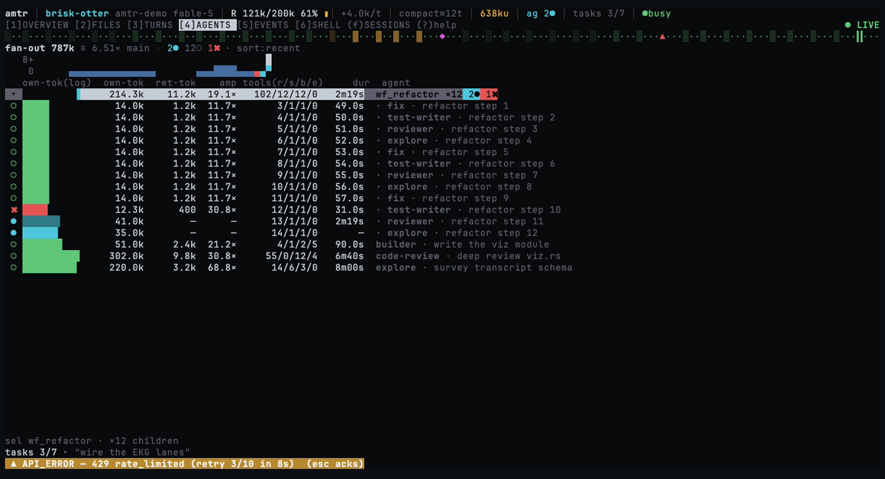 |

**FILES** shows every file's read/write/edit history and a "now" view of what's
being touched this instant (fading on a heat law), with a **waste** column that
prices re-reads. **AGENTS** is a concurrency load-strip over a ledger of each
subagent's own-tokens, return-tokens, amplification, and live duration.

### Session picker — find any session by name or path

Press **`f`** for a searchable, scrollable list of *every* session on your machine
(live ones first). Type to filter by name or project; paste a `.jsonl` path or a
session id to jump straight to it.

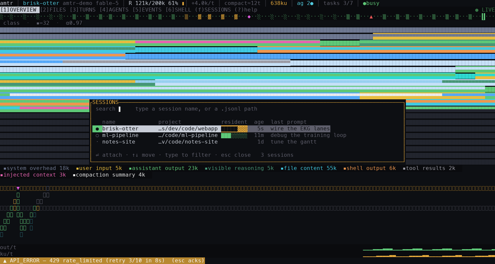

Other tabs: **TURNS** (per-turn stacked cache/input columns with the 5m/1h billing
split), **SHELL** (the command console Claude never shows you + the external-retrieval
feed), and **EVENTS** (compactions, API errors, model fallbacks — with a compaction
post-mortem on `Enter`). A timeline scrubber holds the whole session; `←/→` rewinds
every view to any past turn.

---

## The report — press `R`

`amtr` turns a session's transcript into a compiled, ground-truth **PDF report**:
a self-contained directory with `report.pdf`, animated GIFs + static figures, and a
per-turn capture (`turns.jsonl` / `turns.md`). Everything is rendered locally.

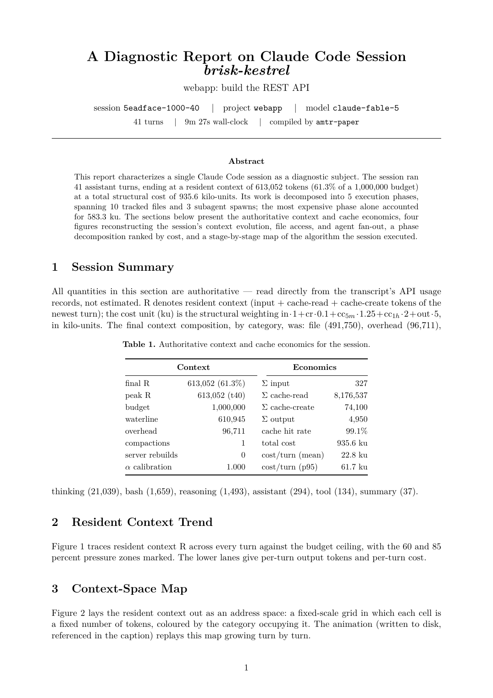

The figures reconstruct the session faithfully:

| Context map | File traffic roll |
|---|---|
| 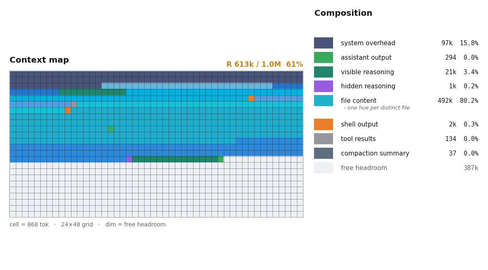 | 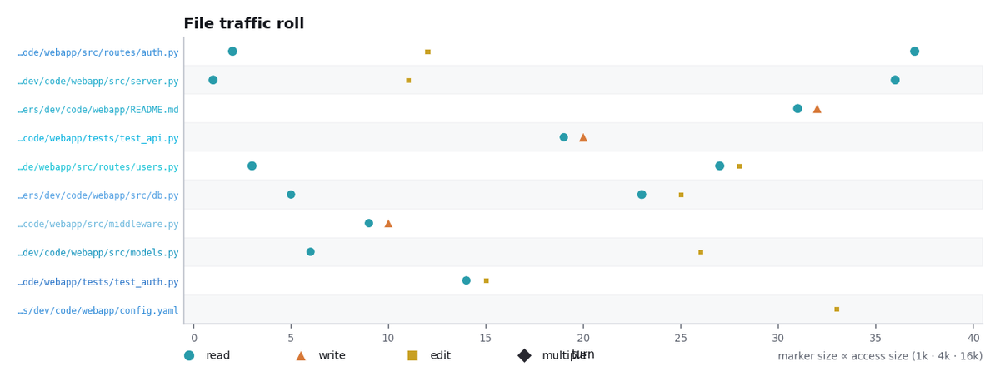 |

| Subagent branch tree | Agent fan-out timeline |
|---|---|
| 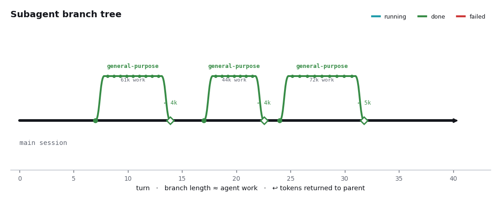 | 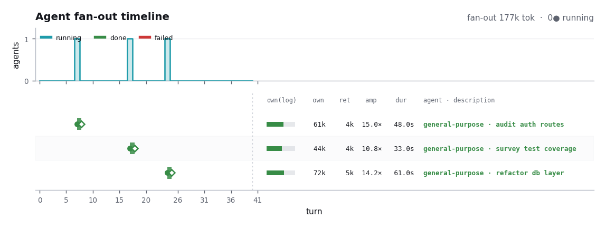 |

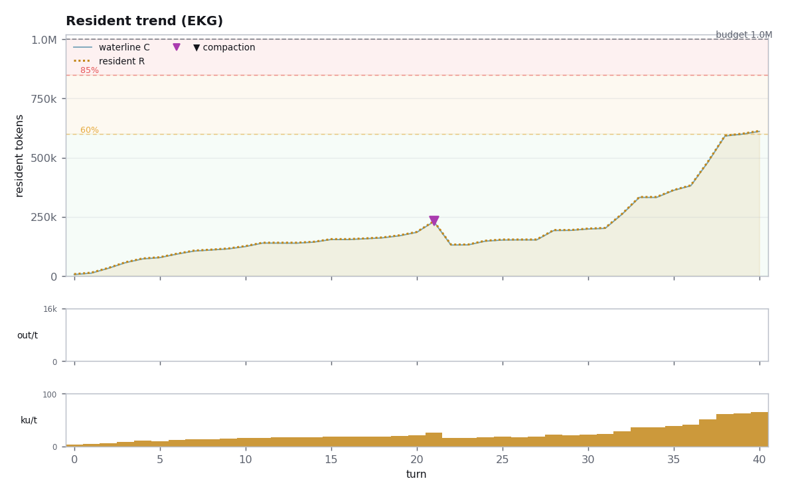

Plus a cost-ranked phase table and a stage-by-stage, turn-by-turn account of what
the session actually did.

---

## Install

### Quick install (prebuilt binary)

No Rust, no Homebrew — one line downloads the binary + engine for your platform
(macOS arm64/x86_64, Linux x86_64/arm64) and installs it under `~/.local`:

```sh
curl -fsSL https://raw.githubusercontent.com/arian-shamaei/anthropometer/main/install.sh | sh
```

If `~/.local/bin` isn't on your `PATH`, the installer tells you how to add it.
Override the install prefix with `AMTR_PREFIX` or pin a version with `AMTR_VERSION`.
The live TUI needs only `python3` (≥3.9, stdlib); the **report** extras (`R`) still
need `pip install matplotlib pillow` plus `brew install tectonic`.

### Homebrew (recommended)

```sh
brew tap arian-shamaei/anthropometer
brew trust arian-shamaei/anthropometer   # newer Homebrew asks you to trust third-party taps
brew install amtr
```

This installs the live TUI (a small Rust binary + a stdlib Python engine — no
heavy dependencies). To enable the **report** feature (`R` / `amtr-paper`):

```sh
pip install matplotlib pillow      # figures
brew install tectonic              # LaTeX → PDF
```

### From source

Needs Rust and Python 3.9+.

```sh
git clone https://github.com/arian-shamaei/anthropometer
cd anthropometer/rust
cargo install --path .             # → ~/.cargo/bin/amtr
```

The engine path is baked in at build time (overridable with `$AMTR_ENGINE`), so
`amtr` runs from any directory.

---

## Usage

```sh
amtr                       # newest/active session, from anywhere
amtr --session S.jsonl     # a specific transcript
amtr --project ~/my/repo   # newest session for that project
amtr --demo                # a self-contained demo (no live session needed)
```

Arm it beside a headless run to get a report the moment it finishes:

```sh
claude -p "do the thing" &
amtr-report --watch        # tails the live session; prints the report when it ends
```

**Keys:** `1`–`6` tabs · `f` sessions · `i` inspect · `m` map mode · `←/→` scrub ·
`R` report · `?` help · `q` quit.

---

## Authoritative vs. estimated

`amtr` is careful about what it *knows* versus what it *estimates*:

- **R (resident context)** — exact: `input + cache_read + cache_creation` of the
  newest assistant `usage` record (the same quantity `/context` reports).
- **The cache waterline** — exact: `cache_read_input_tokens`; backward jumps are
  real prefix invalidations (thrash).
- **Per-item allocations** — estimated (`chars/3.8`), laid out in true prompt order
  and force-fit to sum exactly to R, with the invisible server-side context
  (system prompt, tool schemas) carried as an honest **overhead** segment and a
  displayed calibration factor `α`.
- **Compaction attribution** — from `compact_boundary` set-difference, cross-checked
  against pre/post token counts.

---

## How it works

Two processes over newline-delimited JSON: a **Rust/ratatui UI** that owns only the
terminal, and a **Python engine** that owns all the data (transcript discovery,
tailing, accounting, checkpoints, replay). `SPEC.md` is the normative contract;
both sides are implemented against it alone, and cross-process contract tests spawn
the real engine and require every emitted line to parse.

```
┌───────────────────────────┐   JSON lines over stdin/stdout   ┌───────────────────────────┐
│  amtr  (Rust ratatui bin) │ ── Control (UI → Engine) ──▶      │  amtr_engine.py           │
│  owns ONLY the terminal   │                                  │  (python3 ≥3.9, stdlib)   │
└───────────────────────────┘ ◀── Update (Engine → UI) ──       │  owns ALL data            │
                                                                └───────────────────────────┘
```

## Repository layout

```
SPEC.md            the normative protocol + view contract
amtr_engine.py     the engine: discovery, tailing, accounting, checkpoints, replay
amtr_paper.py      the PDF report builder (amtr_figures/_turns/_phases support it)
rust/              the TUI (cargo test runs a headless screenshot suite)
tests/             engine test suite + synthetic fixtures
packaging/homebrew the Homebrew formula + tap runbook
docs/assets/       screenshots and figures for this README
```

## License

[MIT](LICENSE) © Arian Shamaei
