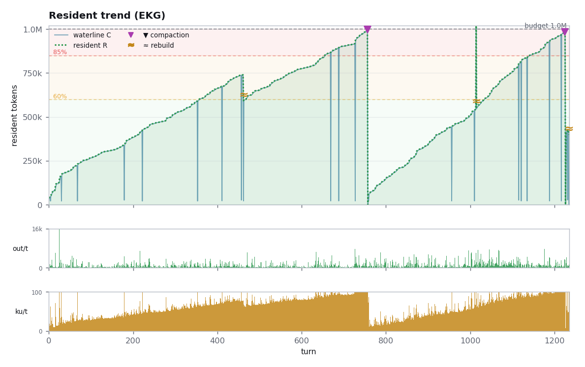
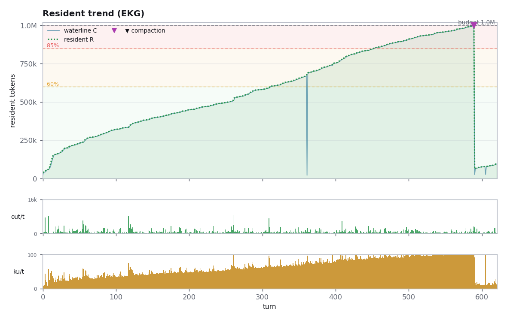

# amtr was built in one conversation. It performed the autopsy itself.

*amtr is the agentic debugger for Claude Code: it attaches to a session's transcript and
shows, live, exactly what is in the model's context window. amtr was itself vibe-coded in Claude
Code — which means the complete, token-level record of its own construction is sitting on disk,
in the very format it was built to read.*

*So we pointed the instrument at its own birth certificates. Every number below is read straight
from the API usage records in the transcripts by amtr's report engine. Nothing is estimated by a
human.*

---

## The headline numbers

| | |
|---|---|
| Total turns | **1,945** |
| Cache-read tokens | **1,023,193,672** (≈1.02 billion) |
| Fresh (uncached) input tokens | 8,517 |
| Output tokens | 1,925,158 |
| Compactions survived | 3 — **2,890,576 tokens forgotten** |
| Shell commands | 568 (13 failed) |
| Cost at Claude Fable 5 list price | **$1,472.25** |

For every token the model read fresh, it re-read **~120,000 from cache**. The overall cache hit
rate across the whole build was ~98%. The economics of vibe-coding are cache economics.

## One conversation

The forensic surprise: amtr is not the product of many sessions. It is essentially **one
conversation** that lived for six days, plus one side-quest and one release-night session.

```
Jul 17  06:41 UTC   Session born in ~/Developer/context-top.
                    First words: "fully learn what this direcotry is and how
                    it applies to its applicaiton"   [sic]
Jul 17  (23h in)    First 24 hours: 412 turns, 107 subagents, 12 phases,
                    zero compactions. Most-edited file: SPEC.md (25 edits).
Jul 18              Forked → session "ivory-koi". Same history, new life.
Jul 19  06:21       Model switch mid-flight: claude-fable-5 → claude-opus-4-8.
                    Server rebuild flushes 254k tokens of reasoning.
Jul 20  21:57       First compaction: 1,005,977 → 12,221 tokens.
                    993,756 tokens of its own construction — forgotten.
Jul 20              v0.1.0 ships. 21 minutes later, the project is renamed:
                    "and inside amtr it needs to say that instead of ctop"
Jul 21–22           Side-quest: amtr3d, a 3D context visualizer. 42h 47m,
                    621 turns, $411.61. It never shipped.
Jul 22              v0.1.4 ships from the same conversation.
Jul 23  15:23       ivory-koi's last recorded token. Final ledger: 152h 41m,
                    1,235 turns, 2 compactions, $1,046.16.
Jul 30  (evening)   A fresh 78-turn, $13.16 session ships v0.1.5.
```

The main session **survived its own project's rename** — the same session ID lives on under two
project directories, because the working directory changed from `context-top` to `anthropometer`
mid-conversation. amtr's report on it reads like a flight recorder: the rename shows up as a
prefix-invalidation thrash event at the exact minute of the v0.1.0 release commits.

## The night of conception, dissected

The first 24 hours are the recursion at its purest. 412 turns, 23 hours, and the single
most-edited file — before any real code — was `SPEC.md`: one write, twenty-five edits. **The tool
was specified into existence before it was built.** The context window's composition at hour 23:
25.6% hidden reasoning, 38.7% attachments, 11.8% shell output, and only 11.5% actual file content.
The instrument's first finding about itself: building software is mostly *not* reading code.


<sub>↑ the context map of the conception session, replayed turn-by-turn. The [agent fan-out timeline](figures/conception-agents.png) for the same night shows all 107 subagents.</sub>

## What a compaction actually looks like

Three times during the build, the conversation hit the 1M-token ceiling and the server compacted
it. The largest: turn 756, 21:57 UTC, July 20 — **1,005,977 tokens compressed to 12,221**. That's
99% of the accumulated construction history — every dead end, every reasoning chain — replaced by
a summary, 45 minutes after v0.1.0 shipped. amtr can name the turn, the timestamp, and the exact
token count of everything its own builder forgot. Try asking any other artifact what its maker
was thinking, and when it stopped remembering.



<sub>↑ the whole life of ivory-koi: two full climbs to the 1M budget, each ending in a compaction
(▼). The blue spikes are waterline invalidations — one of them is the project rename.</sub>

## The road not taken cost $411.61

`amtr3d` — a 3D visualization spin-off — consumed 42 hours 47 minutes, 621 turns, 348 million
cache-read tokens, and one compaction of its own (987,427 tokens dropped). It peaked at 99.9% of
the context budget. It never shipped. The autopsy puts a precise price on exploring a dead end,
which is a number sixteen "how much does vibe-coding cost" blog posts have guessed at and none
have measured.



<sub>↑ amtr3d: one 42-hour climb to 99.9% of the budget, one compaction, zero releases.</sub>

## Run this on your own sessions

Nothing here required instrumentation. Every Claude Code session already writes the transcript
amtr reads — the evidence is on your disk right now, for every session you've ever run.

```
brew install arian-shamaei/tap/amtr    # or see the repo for cargo/source
amtr                                   # attach to your newest session
# press R — it compiles this same PDF report for that session
```

**github.com/arian-shamaei/anthropometer**

---

*Methodology: reports generated by `amtr_paper.py` against the raw `~/.claude/projects/*.jsonl`
transcripts. Session `ivory-koi` is a fork-continuation of the July 17 origin session (verified:
identical opening prompt, 1,282 cross-references to the origin session ID), so per-chapter numbers
above are subsets of its totals, never double-counted. One 1h52m session that grep-matched "amtr"
was excluded — it was an unrelated audio-oscilloscope project. Cost = tokens × Claude Fable 5 API
list prices ($10/MTok input, $1 cache-read, $20 1h-cache-write, $50 output); actual spend was
subscription-covered.*
